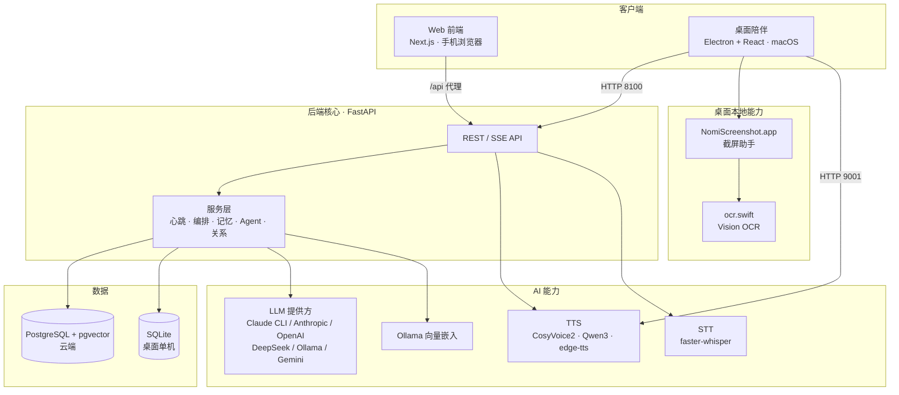

# Nomi · AI 桌面陪伴 / 虚拟角色系统

> 一个有「人格、记忆和内心活动」的 AI 虚拟角色系统。既能作为常驻桌面右下角的 Live2D / 立绘陪伴桌宠，也能在手机浏览器里聊天。角色拥有持久人格、向量记忆、自主"心跳"内心活动、桌面感知能力，以及克隆音色的语音对话。

<p align="center">
  <em>桌面陪伴 · 群聊内心世界 · 语音克隆 · 桌面感知 Agent</em>
</p>

---

## ✨ 这是什么

Nomi 不是一个普通的聊天机器人，而是一套**有内在生命感的虚拟角色系统**：

- 每个角色有**完整人格设定**（性格、出身故事、核心欲望与恐惧、说话风格），可以从一张图片自动生成。
- 角色拥有**长期记忆**（向量检索）和会随对话演化的"年度记忆"，记得过去发生的事。
- 通过**"心跳"系统**，角色在没人和它说话时也会自己产生想法、上网查资料、习得技能、反思——像有自己的内心世界。
- **桌面版**会感知你的屏幕 / 当前应用 / 剪贴板，主动对你正在做的事做出反应，还能帮你开网页、发通知。
- 支持**音色克隆 TTS**（角色用自己的声音说话）和**语音输入 STT**（按住说话）。

整个系统在一台 Apple Silicon Mac 上即可自托管运行。

> 📖 想了解完整的技术架构、API、数据模型和各子系统设计，见 **[docs/ARCHITECTURE.md](docs/ARCHITECTURE.md)**。

---

## 🧩 核心功能

### 角色与人格
- **从图片生成角色**：上传一张图 → 识别外观 → 想象人格 → 批量生成成长记忆 → 合成完整人设 → 克隆音色。
- **多维人格模型**：性格特质、说话风格、出身故事、核心欲望/恐惧、情绪与精力值（0–100）。
- **多状态立绘**：idle / thinking / speaking / listening / happy / sad / surprised 七种表情，按版本管理。

### 对话
- **单人聊天**：记忆增强上下文 + 情绪追踪，支持多种 LLM（DeepSeek、Ollama 本地、Claude CLI）。
- **多角色群聊**：一条消息所有角色并行回应。
- **"心跳"自主内心世界**：唤醒后角色按节拍自主产生**想法 / 网络搜索 / 技能习得 / 反思**，并写入共享对话历史。带注意力机制（话题聚焦与衰减）和内在驱动力（好奇、内省、玩心）。

### 桌面陪伴（Electron）
- 常驻桌面右下角的**透明无边框**陪伴窗，支持 **Live2D** 模型与多状态立绘，带口型同步。
- **桌面感知 Agent**：截屏 OCR、识别当前应用与窗口、读剪贴板，主动对你在做的事做出反应。
- **函数调用**：角色可触发"打开网页""发系统通知"等桌面动作。
- **语音对话**：按住麦克风说话（STT）→ 角色用克隆音色回应（TTS）。

### 记忆与关系
- **向量记忆**：对话后由 LLM 提炼学习点存为记忆，按语义（pgvector 余弦距离）检索召回。
- **记忆演化**：记忆积累会反向影响角色人格。
- **角色间关系**：亲密度、信任、紧张、嫉妒等动态关系网。
- **技能系统**：角色可通过心跳自主"习得"新技能。

### 语音
- **音色克隆 TTS**：CosyVoice2（按角色配置参考音频）/ Qwen3-TTS / edge-tts（兜底）。
- **语音识别 STT**：本地 faster-whisper。

### Web 端
- 移动端优化的聊天界面（`/chat` 单人、`/group-chat` 群聊），玻璃拟态设计，iOS 音频解锁等细节适配。

---

## 🏗️ 系统架构



| 模块 | 技术栈 | 说明 |
|------|--------|------|
| **后端** `backend/` | FastAPI · SQLAlchemy(async) · PostgreSQL+pgvector / SQLite · Redis(可选) | 角色、记忆、心跳、Agent、TTS/STT 全部 API |
| **Web 前端** `frontend/` | Next.js 16 · React 19 · Tailwind 4 | 手机端聊天 / 群聊 |
| **桌面 App** `desktop/` | Electron 35 · React 19 · Vite 6 · Tailwind 4 · pixi-live2d | 透明陪伴窗、Live2D、语音、桌面感知 |
| **语音服务** | CosyVoice2(:9001) · Qwen3-TTS · faster-whisper | 音色克隆 / 合成 / 识别 |
| **GPT-SoVITS** `GPT-SoVITS/` | 第三方（vendored，可选） | 备选 TTS 方案（在 Mac 上不够稳定，详见架构文档） |

---

## 🚀 快速开始

> 推荐环境：Apple Silicon Mac，Python 3.12，Node.js 20+。其他平台未充分测试。

### 1. 后端

```bash
cd backend
python3 -m venv .venv && source .venv/bin/activate
pip install -r requirements.txt

# 配置环境变量（见下方「配置」一节）
cp .env.example ../.env   # 然后填入你自己的 key

# 启动（云端模式，PostgreSQL + 8100 端口）
uvicorn app.main:app --host 0.0.0.0 --port 8100
```

桌面单机模式（SQLite，无需 PostgreSQL/Redis）：

```bash
python backend/desktop/entrypoint.py   # 监听 127.0.0.1:18900
```

### 2. Web 前端

```bash
cd frontend
npm install
npm run dev        # 开发：localhost:3100，/api 反代到后端
# 或 npm run build && npm start
```

### 3. 桌面 App

```bash
cd desktop
npm install
npm run build      # 构建 renderer(vite) + main(tsc)
npm start          # 启动 Electron

# 打包成独立 .app（不依赖 dev 目录 / PATH）
npm run pack       # 或：npx electron-builder --mac -c electron-builder.standalone.yml
```

> 桌面 App 的截图/桌面感知功能依赖一个内置的小助手 `NomiScreenshot.app`，首次使用需在
> **系统设置 → 隐私与安全性 → 屏幕录制** 里授权它（绑定独立身份，授权可长期保留）。

### 4. 语音服务（可选）

- **CosyVoice2**（音色克隆，端口 9001）：需单独部署 [CosyVoice2-0.5B]，启动后后端 `/api/tts/speak-genie` 会自动路由。
- **Ollama**（本地嵌入 + 可选本地 LLM）：`ollama serve`，并 `ollama pull nomic-embed-text`、`ollama pull minicpm-v`。

外部依赖未启动时，对应功能会优雅降级（例如无 CosyVoice 时回退 edge-tts）。

---

## ⚙️ 配置

所有后端环境变量以 `NOMI_` 为前缀，放在仓库根目录 `.env`（已 gitignore）。参考 `.env.example`：

| 变量 | 说明 |
|------|------|
| `NOMI_DATABASE_URL` | `postgresql+asyncpg://...`（云端）或 `sqlite+aiosqlite:///...`（桌面） |
| `NOMI_REDIS_URL` | Redis 连接（可选，桌面模式不需要） |
| `NOMI_LLM_PROVIDER` | `claude-cli` / `anthropic` / `openai` |
| `NOMI_ANTHROPIC_API_KEY` | Anthropic API Key（用 anthropic 提供方时） |
| `NOMI_OPENAI_API_KEY` | OpenAI API Key |
| `NOMI_DEEPSEEK_API_KEY` | DeepSeek API Key（快速聊天模型） |
| `NOMI_GEMINI_API_KEY` | Google Gemini（从图片生成角色 / 视觉） |

> 🔐 **安全提示**：绝不要把真实 API Key 写进源码或提交到仓库。本项目所有密钥都从环境变量读取。

---

## 📂 目录结构

```
nomi/
├── backend/          FastAPI 后端（角色 / 记忆 / 心跳 / Agent / TTS / STT）
│   ├── app/          应用代码（api / services / models / prompts）
│   ├── alembic/      数据库迁移
│   └── desktop/      桌面单机模式入口与打包脚本
├── frontend/         Next.js Web 前端（手机端聊天 / 群聊）
├── desktop/          Electron 桌面陪伴 App
│   ├── src/main/     主进程（窗口 / 后端管理 / IPC / Agent 传感器）
│   ├── src/renderer/ React 渲染层（立绘 / Live2D / 聊天 / 语音）
│   └── tools/        截屏助手 NomiScreenshot.app + ocr.swift
├── GPT-SoVITS/       第三方 TTS（vendored，可选）
└── docs/             架构与设计文档
```

---

## ⚠️ 免责声明

- **角色素材版权**：本仓库示例中使用的部分动漫 / 游戏角色形象、立绘与语音片段，版权归原作者所有，仅作个人学习与技术演示用途，**请勿用于商业目的**。如需公开分发，请替换为你拥有版权或授权的素材。
- **AI 生成内容**：角色对话与行为由大语言模型生成，可能包含不准确或不当内容，不代表作者观点。
- **本项目为个人实验性作品**，按现状（as-is）提供，不保证稳定性与向后兼容。

---

## 📄 License

详见 [LICENSE](LICENSE)（如未添加，请在公开前补充；注意第三方组件 GPT-SoVITS、CosyVoice 等各自遵循其原始许可证）。
